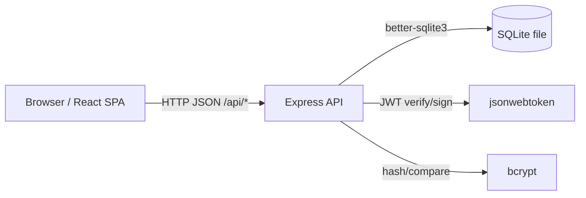

# Component Architecture

## Server Components

### Express App Composition

- Entry point: `packages/server/index.js`
- Middleware:
  - `express.json()` for JSON bodies
  - Auth middleware in `packages/server/middleware/auth.js`
- Routes:
  - `routes/auth.js` (register/login/me)
  - `routes/campaigns.js` (browse + campaign CRUD)
  - `routes/donations.js` (donate + donation history)
  - `routes/dashboard.js` (user dashboard)
- Persistence layer:
  - `packages/server/models/*.js` encapsulate SQL operations
  - `packages/server/db/index.js` creates the SQLite connection

## Client Components

### Routing Topology

The SPA uses `react-router-dom` with these routes:
- `/` → Home
- `/login` → Login
- `/register` → Register
- `/campaigns` → BrowseCampaigns
- `/campaigns/:id` → CampaignDetail
- `/campaigns/new` → CreateCampaign (protected)
- `/campaigns/:id/edit` → EditCampaign (protected)
- `/dashboard` → Dashboard (protected)
- `/profile` → Profile (protected)

### Auth Composition

- `AuthProvider` supplies auth state (token + user) to the app.
- `ProtectedRoute` gates authenticated pages.

## Interaction Diagram

## Boundaries and Rules

- Client does not access the database directly.
- Routes validate inputs and enforce authorization.
- Models own SQL and keep persistence concerns out of routes.

