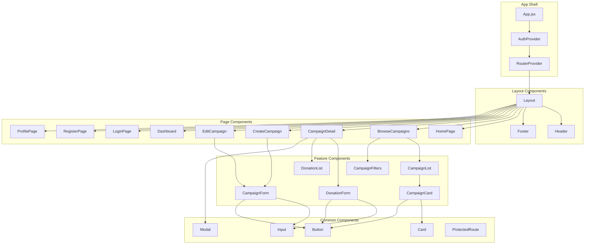
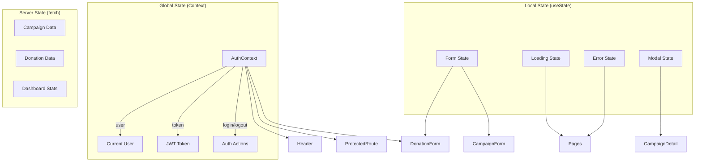
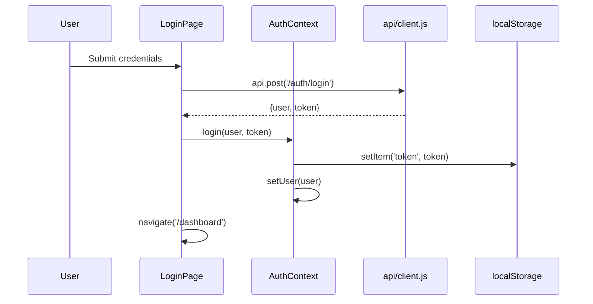
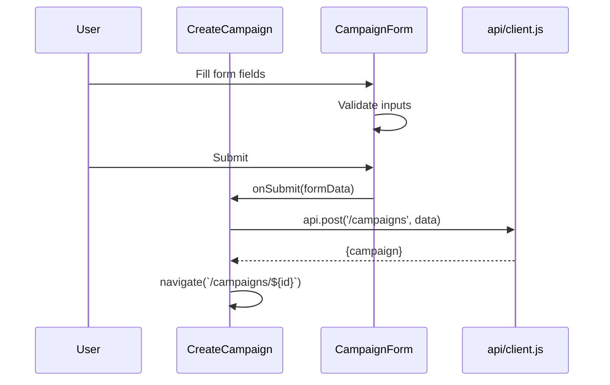

# Component Architecture - YesFundMe

## Component Hierarchy



## Component Catalog

### Layout Components

| Component | File | Props | Responsibility |
|-----------|------|-------|----------------|
| **Layout** | `layout/Layout.jsx` | children | Page wrapper with header/footer |
| **Header** | `layout/Header.jsx` | - | Navigation, auth state display |
| **Footer** | `layout/Footer.jsx` | - | Site footer with links |

### Page Components

| Component | File | Route | Auth Required |
|-----------|------|-------|---------------|
| **HomePage** | `pages/Home.jsx` | `/` | No |
| **BrowseCampaigns** | `pages/BrowseCampaigns.jsx` | `/campaigns` | No |
| **CampaignDetail** | `pages/CampaignDetail.jsx` | `/campaigns/:id` | No |
| **CreateCampaign** | `pages/CreateCampaign.jsx` | `/campaigns/new` | Yes |
| **EditCampaign** | `pages/EditCampaign.jsx` | `/campaigns/:id/edit` | Yes (owner) |
| **Dashboard** | `pages/Dashboard.jsx` | `/dashboard` | Yes |
| **LoginPage** | `pages/Login.jsx` | `/login` | No |
| **RegisterPage** | `pages/Register.jsx` | `/register` | No |
| **ProfilePage** | `pages/Profile.jsx` | `/profile` | Yes |

### Feature Components

| Component | File | Props | Used By |
|-----------|------|-------|---------|
| **CampaignForm** | `campaigns/CampaignForm.jsx` | campaign?, onSubmit | CreateCampaign, EditCampaign |
| **CampaignList** | `campaigns/CampaignList.jsx` | campaigns | BrowseCampaigns, Dashboard |
| **CampaignCard** | `campaigns/CampaignCard.jsx` | campaign | CampaignList |
| **CampaignFilters** | `campaigns/CampaignFilters.jsx` | filters, onChange | BrowseCampaigns |
| **DonationForm** | `donations/DonationForm.jsx` | campaignId, onSuccess | CampaignDetail |
| **DonationList** | `donations/DonationList.jsx` | donations | CampaignDetail |

### Common Components

| Component | File | Props | Description |
|-----------|------|-------|-------------|
| **Button** | `common/Button.jsx` | variant, size, disabled, onClick, children | Styled button with variants |
| **Input** | `common/Input.jsx` | label, type, error, ...inputProps | Form input with label/error |
| **Card** | `common/Card.jsx` | children, className | Container card component |
| **Modal** | `common/Modal.jsx` | isOpen, onClose, title, children | Overlay modal dialog |
| **ProtectedRoute** | `auth/ProtectedRoute.jsx` | children | Auth guard wrapper |

## State Management



## Data Flow Patterns

### Authentication Flow



### Campaign Creation Flow



## Component Conventions

### File Structure
```
components/
├── auth/
│   └── ProtectedRoute.jsx
├── campaigns/
│   ├── CampaignCard.jsx
│   ├── CampaignFilters.jsx
│   ├── CampaignForm.jsx
│   └── CampaignList.jsx
├── common/
│   ├── Button.jsx
│   ├── Card.jsx
│   ├── Input.jsx
│   └── Modal.jsx
├── donations/
│   ├── DonationForm.jsx
│   └── DonationList.jsx
└── layout/
    ├── Footer.jsx
    ├── Header.jsx
    └── Layout.jsx
```

### Naming Conventions
- Components: PascalCase (`CampaignCard.jsx`)
- Props: camelCase (`onSubmit`, `isLoading`)
- Event handlers: `handle*` or `on*` (`handleSubmit`, `onClick`)
- State setters: `set*` (`setLoading`, `setError`)

### Prop Patterns
- **Render props**: Not used
- **Children**: Layout components, Card, Modal
- **Callbacks**: `onSubmit`, `onChange`, `onClose`, `onSuccess`
- **Boolean flags**: `isLoading`, `isOpen`, `disabled`
