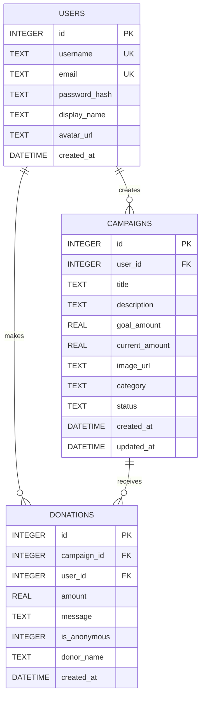
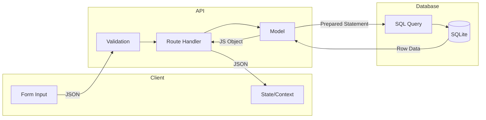

# Data Architecture - YesFundMe

## Database Design

**Engine**: SQLite 3.x via better-sqlite3 (synchronous)
**Location**: `packages/server/yesfundme.db`
**Schema**: `packages/database/schema.sql`

## Entity Relationship Diagram

## Entity Catalog

| Entity | File | Type | Key Fields | Relationships |
|--------|------|------|------------|---------------|
| **User** | `models/user.js` | Database Model | id, username, email, password_hash | Has many Campaigns, Has many Donations |
| **Campaign** | `models/campaign.js` | Database Model | id, user_id, title, goal_amount, status | Belongs to User, Has many Donations |
| **Donation** | `models/donation.js` | Database Model | id, campaign_id, user_id, amount | Belongs to Campaign, Belongs to User (optional) |

### User Entity
- **Purpose**: Registered platform users who can create campaigns and donate
- **Fields**: id, username, email, password_hash, display_name, avatar_url, created_at
- **Constraints**: username UNIQUE, email UNIQUE
- **Business Rules**: Can create unlimited campaigns, can donate to any campaign

### Campaign Entity
- **Purpose**: Fundraising campaigns created by users
- **Fields**: id, user_id, title, description, goal_amount, current_amount, image_url, category, status, created_at, updated_at
- **Constraints**: user_id FK to users
- **Status Values**: 'active', 'completed', 'cancelled'
- **Categories**: community, animals, creative, education, medical, business, sports, emergency
- **Business Rules**: current_amount updated on each donation

### Donation Entity
- **Purpose**: Individual contributions to campaigns
- **Fields**: id, campaign_id, user_id, amount, message, is_anonymous, donor_name, created_at
- **Constraints**: campaign_id FK to campaigns, user_id FK to users (nullable for guests)
- **Business Rules**: Guest donations use donor_name field, user_id is NULL

## Indexes

| Index | Table | Column(s) | Purpose |
|-------|-------|-----------|---------|
| `idx_campaigns_user_id` | campaigns | user_id | Fast user campaign lookup |
| `idx_campaigns_category` | campaigns | category | Category filtering |
| `idx_campaigns_status` | campaigns | status | Active campaigns filter |
| `idx_donations_campaign_id` | donations | campaign_id | Campaign donation list |
| `idx_donations_user_id` | donations | user_id | User donation history |

## Data Flow

## Data Access Patterns

| Operation | Model Function | SQL Pattern |
|-----------|----------------|-------------|
| Create User | `createUser()` | INSERT RETURNING |
| Find User | `findByUsername()` | SELECT WHERE |
| List Campaigns | `getAllCampaigns()` | SELECT with JOIN, pagination |
| Create Donation | `createDonation()` | INSERT + UPDATE (non-atomic) |
| Dashboard Stats | `getDashboardData()` | Aggregate queries |

## Data Integrity

| Concern | Implementation |
|---------|----------------|
| Foreign Keys | Defined in schema, not enforced by SQLite default |
| Cascading Deletes | Not implemented (orphaned records possible) |
| Transactions | Used in seed.js, missing in donation creation |
| Defaults | current_amount=0, status='active', is_anonymous=0 |

## Known Data Issues

1. **Non-atomic donation**: Insert donation and update campaign total are separate operations
2. **No cascade delete**: Deleting user leaves orphaned campaigns/donations
3. **Guest donor tracking**: donor_name field not consistently used in display
