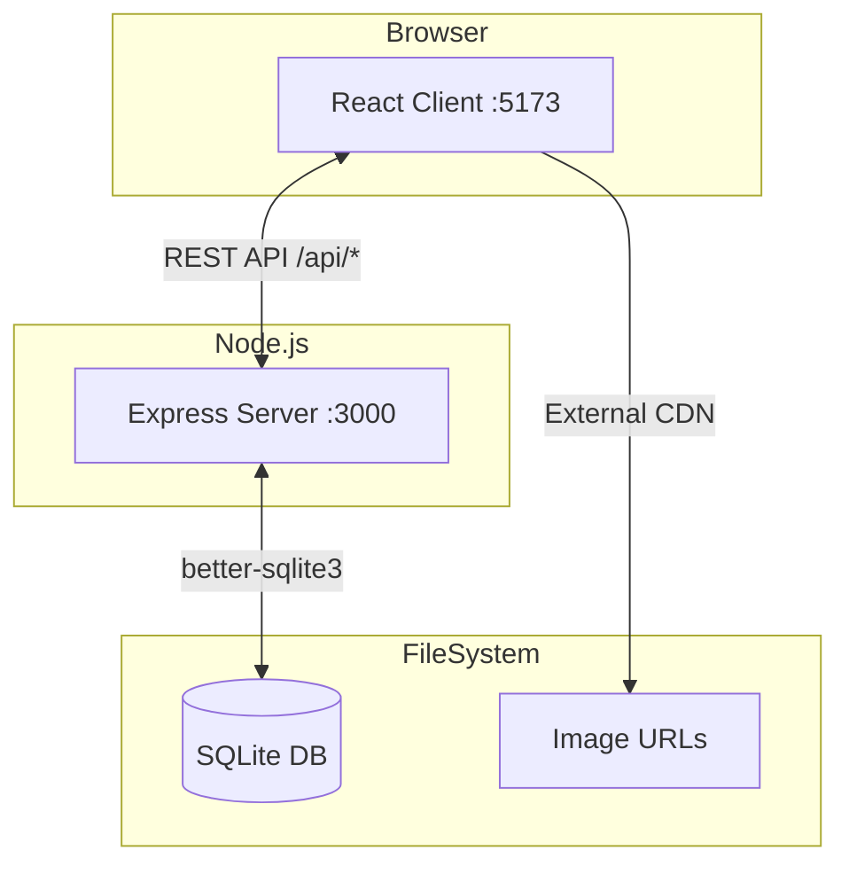

# Integration Landscape - YesFundMe

## Integration Overview

YesFundMe is a **self-contained application** with no external service integrations. All functionality is implemented locally.

## Internal Integration Points



## API Contract

### Base URL
- **Development**: `http://localhost:3000/api`
- **Vite Proxy**: Client requests to `/api` proxied to `:3000`

### Endpoints

| Method | Endpoint | Auth | Description |
|--------|----------|------|-------------|
| GET | `/health` | No | Health check |
| POST | `/auth/register` | No | User registration |
| POST | `/auth/login` | No | User login |
| GET | `/auth/me` | Yes | Current user |
| PUT | `/auth/me` | Yes | Update profile |
| GET | `/campaigns` | No | List campaigns |
| GET | `/campaigns/:id` | No | Campaign details |
| POST | `/campaigns` | Yes | Create campaign |
| PUT | `/campaigns/:id` | Yes | Update campaign |
| DELETE | `/campaigns/:id` | Yes | Close campaign |
| POST | `/campaigns/:id/donations` | No | Make donation |
| GET | `/dashboard` | Yes | User dashboard |

### Request/Response Format

```json
// Request (POST /api/auth/login)
{
  "username": "string",
  "password": "string"
}

// Response (Success)
{
  "user": {
    "id": "number",
    "username": "string",
    "email": "string",
    "displayName": "string",
    "avatarUrl": "string"
  },
  "token": "string (JWT)"
}

// Response (Error)
{
  "error": "string"
}
```

## External Resources (CDN Only)

| Resource | Provider | Usage |
|----------|----------|-------|
| Campaign Images | Unsplash | `image_url` field stores full URLs |
| User Avatars | DiceBear | Generated avatar SVGs |

## Communication Protocols

| Protocol | Usage | Library |
|----------|-------|---------|
| HTTP/REST | Client-Server | fetch (native) |
| JSON | Data serialization | Built-in |
| JWT | Auth tokens | jsonwebtoken |

## Vite Proxy Configuration

```javascript
// vite.config.js
export default defineConfig({
  server: {
    proxy: {
      '/api': {
        target: 'http://localhost:3000',
        changeOrigin: true
      }
    }
  }
})
```

## Future Integration Considerations

If the app were to grow, potential integrations would include:

| Service Type | Example | Purpose |
|--------------|---------|---------|
| Payment Processing | Stripe | Real donations |
| Email Service | SendGrid | Notifications |
| File Storage | S3/Cloudinary | Image uploads |
| Analytics | Mixpanel | Usage tracking |
| Auth Provider | Auth0 | Social login |
