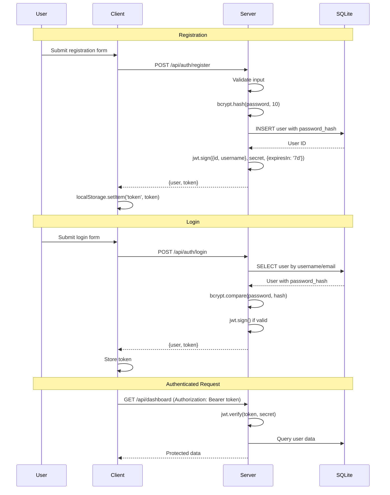

# Security Architecture - YesFundMe

## Authentication Flow



## Authentication Mechanisms

| Mechanism | Implementation | Location |
|-----------|----------------|----------|
| Password Hashing | bcrypt with 10 salt rounds | `routes/auth.js:36` |
| Token Generation | JWT with 7-day expiry | `middleware/auth.js:37-42` |
| Token Verification | jwt.verify middleware | `middleware/auth.js:5-20` |
| Token Storage | localStorage | `api/client.js:9-14` |

## Authorization Model

| Resource | Public | Auth Required | Owner Only |
|----------|--------|---------------|------------|
| View campaigns | ✅ | | |
| View campaign details | ✅ | | |
| Make donation | ✅ (guest allowed) | | |
| Create campaign | | ✅ | |
| Edit campaign | | | ✅ |
| Delete/close campaign | | | ✅ |
| View dashboard | | ✅ | |
| Update profile | | ✅ | |

## Security Controls

### Input Validation
- **Registration**: Username ≥3 chars, password ≥6 chars, email format
- **Login**: Required username/password
- **Campaigns**: Required title, description, goal_amount, category
- **Donations**: Amount > 0, donor name required for guests

### Data Protection
- Passwords: Never stored in plain text (bcrypt hash only)
- JWT Secret: Environment variable (`JWT_SECRET`)
- Sensitive Data: Password hash excluded from API responses

### Middleware Chain

```javascript
// Protected route example
router.put('/campaigns/:id', authenticateToken, (req, res) => {
  // req.user populated by middleware
  if (campaign.user_id !== req.user.id) {
    return res.status(403).json({ error: 'Not authorized' })
  }
  // ... update logic
})
```

## Security Gaps (Learning Project)

| Gap | Risk | Production Fix |
|-----|------|----------------|
| JWT in localStorage | XSS vulnerability | Use httpOnly cookies |
| No CSRF protection | Cross-site requests | Add CSRF tokens |
| No rate limiting | Brute force attacks | Add express-rate-limit |
| Weak JWT secret default | Token forgery | Require strong secret |
| No input sanitization | XSS/injection | Add sanitization middleware |
| No HTTPS enforcement | Man-in-the-middle | Force HTTPS in production |

## Token Structure

```javascript
// JWT Payload
{
  "id": 1,
  "username": "johndoe",
  "iat": 1706567890,      // Issued at
  "exp": 1707172690       // Expires (7 days later)
}
```
