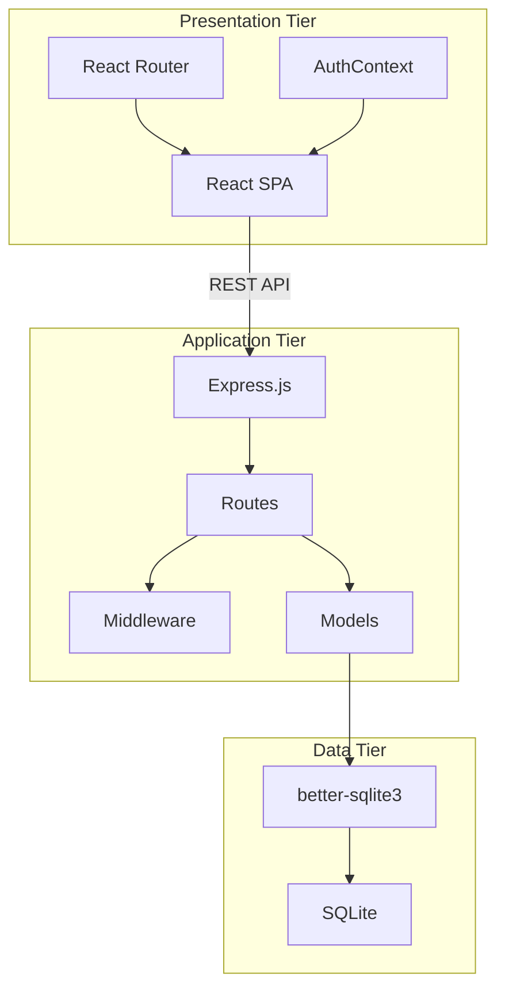
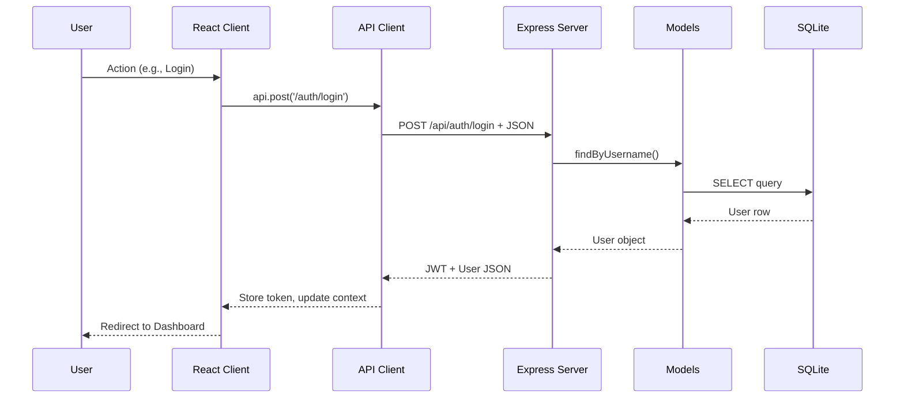

# System Analysis - YesFundMe

## Architectural Style

**Classification**: Monorepo Client-Server Architecture (3-Tier)

## Architectural Patterns

- **SPA + REST API**: React frontend communicates via JSON REST endpoints
- **Repository Pattern**: Models encapsulate all database operations
- **Context Pattern**: React Context for global auth state
- **Protected Routes**: HOC pattern for authenticated routes
- **Middleware Chain**: Express middleware for auth validation

## Design Decisions

| Decision | Rationale | Trade-off |
|----------|-----------|-----------|
| Monorepo (npm workspaces) | Simplified dependency management, atomic commits | Larger repo size |
| SQLite + better-sqlite3 | Zero-config, synchronous API, file-based | Not suited for concurrent writes at scale |
| JWT Authentication | Stateless, no session storage needed | Token revocation requires extra logic |
| Vite for bundling | Fast HMR, modern ES modules | Newer tool, less ecosystem maturity |
| Tailwind CSS | Rapid UI development, no CSS files | Verbose class names in JSX |
| ES Modules throughout | Modern syntax, tree-shaking | Requires Node 22+ |

## Component Interaction

## Module Boundaries

| Module | Responsibility | Dependencies |
|--------|---------------|--------------|
| `packages/client` | UI rendering, routing, state | React, React Router, Tailwind |
| `packages/server` | API endpoints, business logic | Express, JWT, bcrypt |
| `packages/database` | Schema definition, seeding | better-sqlite3 |

## Cross-Cutting Concerns

- **Error Handling**: Try-catch in routes, error boundaries in React (not implemented)
- **Logging**: Console.log/error (basic)
- **Validation**: Manual validation in routes and forms
- **Configuration**: Environment variables via `.env`
