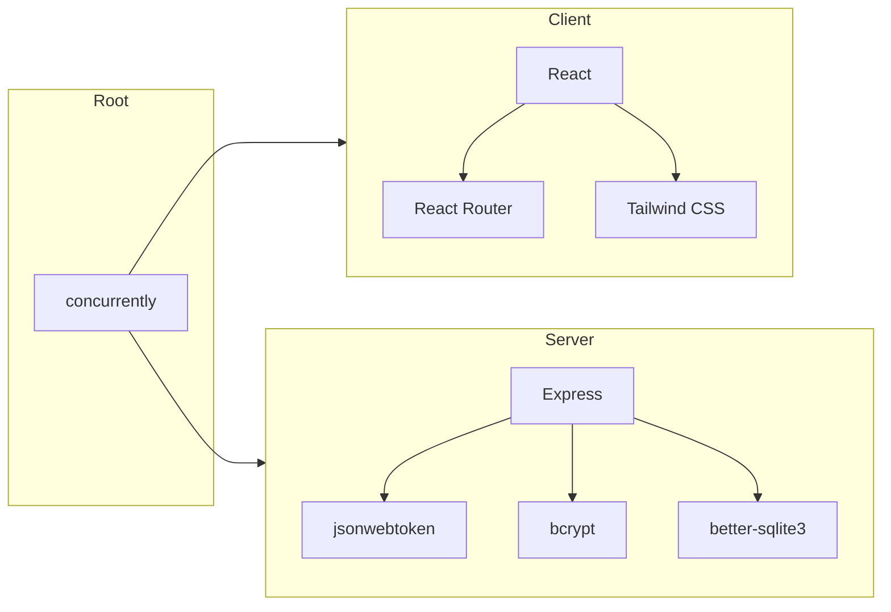

# Technology Stack - YesFundMe

## Stack Overview

| Layer | Technology | Version | Purpose |
|-------|------------|---------|---------|
| **Frontend** | | | |
| Framework | React | 19.2.0 | UI components, state management |
| Routing | React Router DOM | 7.13.0 | Client-side navigation |
| Build Tool | Vite | 7.2.4 | Development server, bundling |
| Styling | Tailwind CSS | 4.1.18 | Utility-first CSS |
| Compiler | SWC (via plugin) | - | Fast JSX transformation |
| **Backend** | | | |
| Runtime | Node.js | 22.x | JavaScript runtime |
| Framework | Express.js | 4.21.0 | HTTP server, routing |
| Auth | jsonwebtoken | 9.0.3 | JWT generation/verification |
| Password | bcrypt | 6.0.0 | Password hashing |
| **Database** | | | |
| Engine | SQLite | 3.x | Relational database |
| Driver | better-sqlite3 | 12.6.2 | Synchronous bindings |
| **DevOps** | | | |
| Package Manager | npm | 10.x | Dependency management |
| Monorepo | npm workspaces | - | Multi-package management |
| Server Reload | nodemon | 3.1.0 | Auto-restart on changes |
| Concurrency | concurrently | 9.2.1 | Run client + server |
| Linting | ESLint | 9.39.1 | Code quality |

## Frontend Architecture

```
packages/client/
├── src/
│   ├── api/           # API client wrapper
│   │   └── client.js  # Fetch wrapper with auth
│   ├── components/    # Reusable UI components
│   │   ├── auth/      # ProtectedRoute
│   │   ├── campaigns/ # Campaign cards, forms, filters
│   │   ├── common/    # Button, Input, Modal, Card
│   │   ├── donations/ # Donation forms, lists
│   │   └── layout/    # Header, Footer, Layout
│   ├── context/       # React Context providers
│   │   └── AuthContext.jsx
│   ├── pages/         # Route-level components
│   └── main.jsx       # Entry point
├── index.html         # SPA shell
└── vite.config.js     # Build configuration
```

## Backend Architecture

```
packages/server/
├── db/
│   ├── index.js       # Database connection
│   └── init.js        # Schema initialization
├── middleware/
│   └── auth.js        # JWT verification
├── models/
│   ├── user.js        # User CRUD operations
│   ├── campaign.js    # Campaign CRUD operations
│   └── donation.js    # Donation operations
├── routes/
│   ├── auth.js        # /api/auth/*
│   ├── campaigns.js   # /api/campaigns/*
│   ├── donations.js   # /api/campaigns/:id/donations
│   └── dashboard.js   # /api/dashboard
└── index.js           # Express app entry
```

## Database Schema

```
packages/database/
├── schema.sql         # Table definitions
└── seed.js            # Test data seeding
```

## Dependency Graph



## Version Constraints

| Requirement | Minimum | Reason |
|-------------|---------|--------|
| Node.js | 22.0.0 | ES Modules, native fetch |
| npm | 10.0.0 | Workspaces support |
